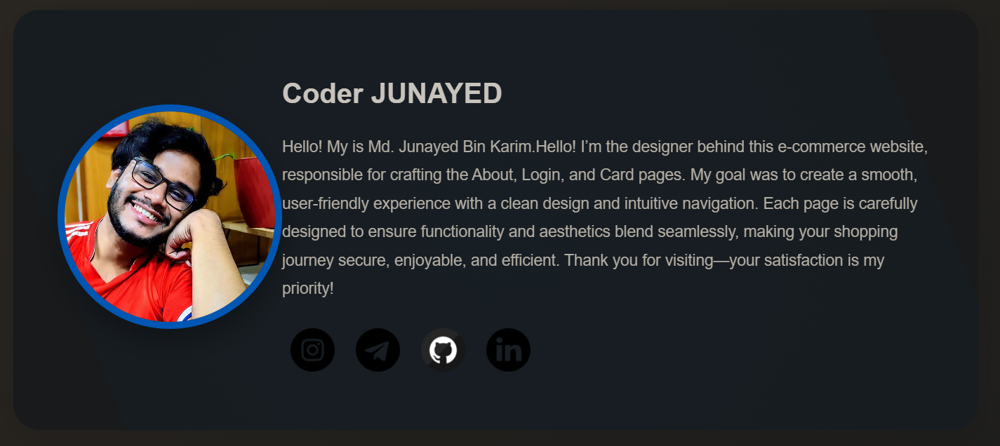

# About-Me-Page 
Responsive About Me Page Using HTML and CSS.

 Excited to share my latest project: a stunning and responsive about me page built from scratch using HTML and CSS!  This sleek design adapts seamlessly to all devices, ensuring a seamless user experience. Proud to showcase my web development skills in action! Check it out and let me know what you think

## Screenshots

Here is a screenshot of the project:



## Features
- Responsive layout
- Smooth animations and transitions
- Elegant and clean design
- Interactive social media icons

## Installation

To get started with this project, clone the repository:

```bash
git clone https://github.com/Junayed-Bin-Karim/About-Me-Page.git
